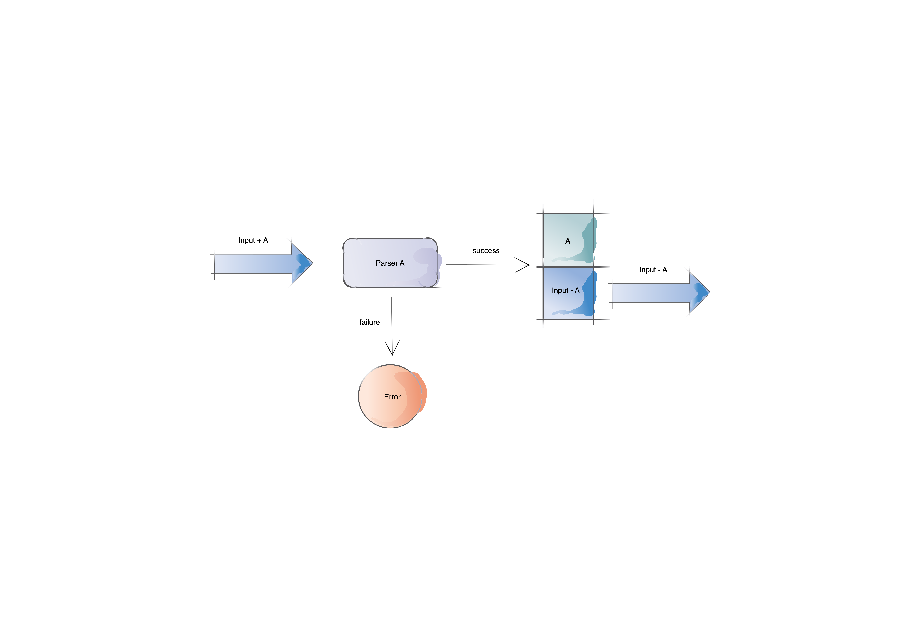
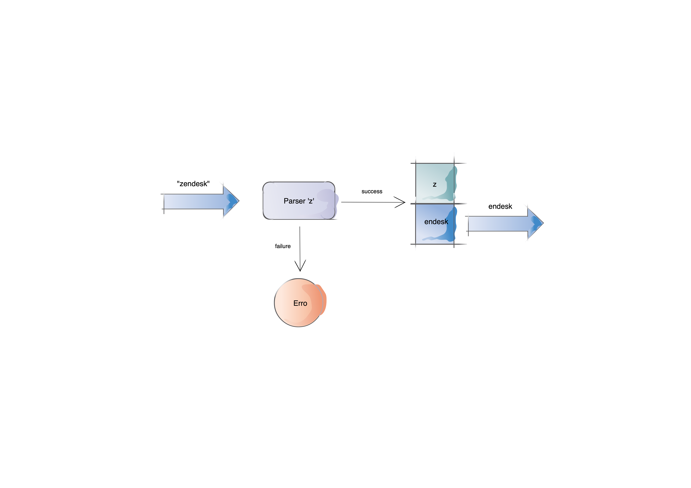

# Build you a Parser Combinator for Great Good

<br/>
<br/>
<br/>
<br/>
<br/>
<br/>
<br/>
<br/>
<br/>
<br/>
<br/>
<br/>
<br/>
<br/>
<br/>
<br/>
<br/>
<br/>
<br/>
<br/>
<br/>
<br/>
<br/>
<br/>
<br/>
<br/>
<br/>
<br/>
<br/>
<br/>
<br/>
<br/>
<br/>

# What is a parser?

> a parser is just a function that consumes less-structured input and produces more-structured output.
- Alexis King from [Parse Don't Validate](https://lexi-lambda.github.io/blog/2019/11/05/parse-don-t-validate/)


<br/>
<br/>
<br/>
<br/>
<br/>
<br/>
<br/>
<br/>
<br/>
<br/>
<br/>
<br/>
<br/>
<br/>
<br/>
<br/>
<br/>
<br/>
<br/>
<br/>
<br/>
<br/>

> For our purposed we can think of a parser that takes in some text input and converts into something more specific.


```haskell
String -> Char
String -> Int
String -> Bool
```


<br/>
<br/>
<br/>
<br/>
<br/>
<br/>
<br/>
<br/>
<br/>
<br/>
<br/>
<br/>
<br/>
<br/>
<br/>
<br/>
<br/>
<br/>
<br/>
<br/>
<br/>
<br/>

# What is a Parser Combinator?

- Is a type of parser
- Is partial function from some input to some output
- Has a way of signalling failure
- Simple pieces combined to create more advanced pieces (grammar)


<br/>
<br/>
<br/>
<br/>
<br/>
<br/>
<br/>
<br/>
<br/>
<br/>
<br/>
<br/>
<br/>
<br/>
<br/>
<br/>
<br/>
<br/>
<br/>
<br/>
<br/>
<br/>


These features will become clearer when we work through the exercise

<br/>
<br/>
<br/>
<br/>
<br/>
<br/>
<br/>
<br/>
<br/>
<br/>
<br/>




<br>
<br>
<br>
<br>
<br>
<br>
<br>




<br/>
<br/>
<br/>
<br/>
<br/>
<br/>
<br/>
<br/>
<br/>
<br/>
<br/>

# Haskell Syntax

## Functions

```haskell
someFunction :: String -> Int -> Bool -- function definition
```


```haskell
someFunction str n = True -- function implementation
```

<br/>
<br/>
<br/>
<br/>
<br/>
<br/>
<br/>
<br/>
<br/>
<br/>
<br/>

```scala
// scala
def someFunction(param1: String, param2: Int): Boolean = True //function definition + implementation
```


<br/>
<br/>
<br/>
<br/>
<br/>
<br/>
<br/>
<br/>
<br/>
<br/>
<br/>


```haskell
function name
     |
someFunction ::   String    ->    Int    ->    Bool
             |      |              |            |
             |   param type1  param type2  result type
             |
      start of function definition
```

<br/>
<br/>
<br/>
<br/>
<br/>
<br/>
<br/>
<br/>
<br/>
<br/>
<br/>

```haskell
function name
     |
someFunction str   n   = True -- function implementation
              |    |       |
          param1 param2 result
```

<br/>
<br/>
<br/>
<br/>
<br/>
<br/>
<br/>
<br/>
<br/>
<br/>
<br/>

## Pattern matching

<br/>
<br/>
<br/>
<br/>
<br/>
<br/>
<br/>
<br/>
<br/>
<br/>
<br/>
<br/>
<br/>
<br/>
<br/>
<br/>
<br/>
<br/>
<br/>
<br/>
<br/>
<br/>

```scala
//scala        Either[l, r]
either match {
  case Left(error)  => ???
  case Right(value) => ???
}

```


<br/>
<br/>
<br/>
<br/>
<br/>


```haskell
-- haskell     Either l r
case either of
  Left error  -> undefined
  Right value -> undefined
```


<br/>
<br/>
<br/>
<br/>
<br/>
<br/>
<br/>
<br/>
<br/>
<br/>
<br/>
<br/>
<br/>
<br/>
<br/>
<br/>
<br/>
<br/>
<br/>
<br/>
<br/>
<br/>

<br/>
<br/>
<br/>
<br/>
<br/>
<br/>
<br/>
<br/>
<br/>
<br/>
<br/>


```scala
// scala       Option[A]
option match {
  None        => ???
  Some(value) => ???
}
```

<br/>
<br/>
<br/>
<br/>
<br/>

```haskell
-- haskell     Maybe a
case option of
  Nothing    -> undefined
  Just value -> undefined
```


<br/>
<br/>
<br/>
<br/>
<br/>
<br/>
<br/>
<br/>
<br/>
<br/>
<br/>
<br/>
<br/>
<br/>
<br/>
<br/>
<br/>
<br/>
<br/>
<br/>
<br/>
<br/>

```scala
//scala
def someFunction(param1: String, param2: Int): Boolean = {
  (param1, param2) match {
    case ("Hello", 1) => ???
    case ("Hello", 2) => ???
    case (str,     n) => ???
  }
}
```


<br/>
<br/>
<br/>
<br/>
<br/>


```haskell
-- haskell
someFunction :: String -> Int -> Bool
someFunction "Hello" 1 = undefined
someFunction "Hello" 2 = undefined
someFunction str     n = undefined
```


<br/>
<br/>
<br/>
<br/>
<br/>
<br/>
<br/>
<br/>
<br/>
<br/>
<br/>
<br/>
<br/>
<br/>
<br/>
<br/>
<br/>
<br/>
<br/>
<br/>
<br/>
<br/>

```scala
// scala
def isEmpty[A](list: List[A]): Boolean = {
  list match {
    case Nil      => true
    case (h :: t) => false
  }
}
```

<br/>
<br/>
<br/>
<br/>
<br/>

```haskell
-- haskell
isEmpty :: [a] -> Bool
isEmpty []    = True
isEmpty (h:t) = False
```


<br/>
<br/>
<br/>
<br/>
<br/>
<br/>
<br/>
<br/>
<br/>
<br/>
<br/>
<br/>
<br/>
<br/>
<br/>
<br/>
<br/>
<br/>
<br/>
<br/>
<br/>
<br/>

```haskell
type String = [Char]
```

<br/>
<br/>
<br/>
<br/>
<br/>
<br/>
<br/>
<br/>
<br/>
<br/>
<br/>
<br/>
<br/>
<br/>
<br/>
<br/>
<br/>
<br/>
<br/>
<br/>
<br/>
<br/>

```scala
// scala
class Blah(val someFunction: String => Int) extends AnyVal
```


<br/>
<br/>
<br/>
<br/>
<br/>

```haskell
-- haskell
newtype Blah = Blah { someFunction :: String -> Int }
```


<br/>
<br/>
<br/>
<br/>
<br/>
<br/>
<br/>
<br/>
<br/>
<br/>
<br/>
<br/>
<br/>
<br/>
<br/>
<br/>
<br/>
<br/>
<br/>
<br/>
<br/>
<br/>

# Let's Build it!
